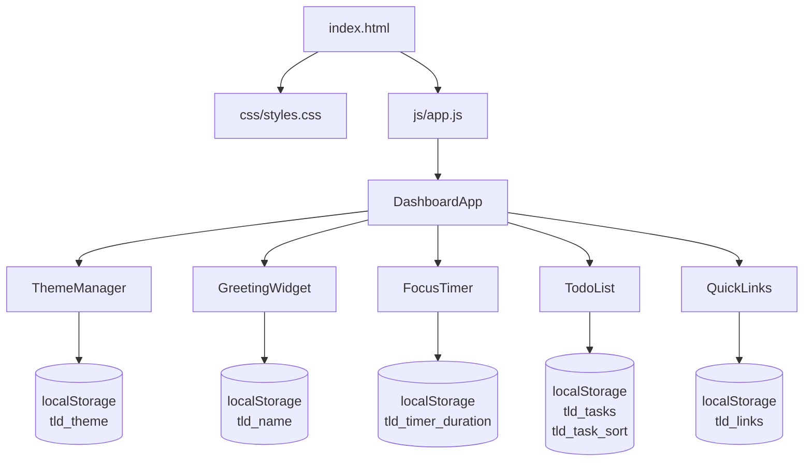

# Design Document — Dashboard Enhancements

## Overview

This document describes the technical design for five incremental enhancements to the existing **To-Do List Life Dashboard** — a vanilla JS single-page application delivered as three files (`index.html`, `css/styles.css`, `js/app.js`). All changes must remain within those three files with no new files, no external dependencies, and no build step.

The five enhancements are:

| # | Feature | New localStorage key |
|---|---|---|
| 1 | Light / Dark Mode | `tld_theme` |
| 2 | Custom Name in Greeting | `tld_name` |
| 3 | Configurable Pomodoro Duration | `tld_timer_duration` |
| 4 | Prevent Duplicate Tasks | *(none — logic only)* |
| 5 | Sort Tasks | `tld_task_sort` |

Each enhancement is additive: it extends an existing module or adds a small new one without restructuring the IIFE or changing the public API of unrelated modules.

---

## Architecture

### High-Level Structure (after enhancements)



### Module Order in `js/app.js` (unchanged IIFE structure)

```
js/app.js  (IIFE)
├── StorageService          — unchanged
├── ThemeManager            — NEW: toggle(), loadTheme()
├── GreetingWidget          — EXTENDED: name load/save, personalised greeting
├── FocusTimer              — EXTENDED: configuredMinutes, duration input
├── TodoList                — EXTENDED: duplicate check, sort control
├── QuickLinks              — unchanged
└── DashboardApp            — EXTENDED: calls ThemeManager.loadTheme() first
```

`ThemeManager` is inserted between `StorageService` and `GreetingWidget` so that the theme is applied before any widget renders. `DashboardApp.init()` calls `ThemeManager.loadTheme()` as its first action.

### Theme Application Strategy

The dark theme is applied by setting a `data-theme="dark"` attribute on the `<html>` element. CSS custom properties (variables) defined on `:root` and overridden under `[data-theme="dark"]` control all colours. This approach:

- Requires no JavaScript to know which elements to update — CSS handles propagation automatically.
- Works with the existing widget structure without touching individual widget styles.
- Is the standard, widely-supported pattern for CSS-variable-based theming.

---

## Components and Interfaces

### ThemeManager (new module)

A stateless utility that reads/writes the theme preference and applies it to the DOM.

```js
ThemeManager = {
  loadTheme()   → void  // reads tld_theme from localStorage; applies "light" if absent
  toggle()      → void  // flips current theme, persists, applies, updates toggle button label
}
```

**DOM interaction:**
- Reads/writes `data-theme` attribute on `document.documentElement` (`<html>`).
- Updates the text content of `#btn-theme-toggle` to reflect the *opposite* theme (i.e., "Dark Mode" when light is active, "Light Mode" when dark is active).

**Integration point:** `DashboardApp.init()` calls `ThemeManager.loadTheme()` before initialising any widget.

### GreetingWidget (extended)

Two new responsibilities are added to the existing `init()` closure:

1. **Name persistence** — on init, read `tld_name` from `StorageService`; on save, write trimmed name (or remove key if empty).
2. **Personalised greeting** — `render()` appends `, {name}` to the greeting string when a name is stored.

```js
// Extended internal helpers (inside init closure)
loadName()          → string   // StorageService.get("tld_name") || ""
saveName(name)      → void     // StorageService.set / remove
renderGreeting()    → void     // uses stored name; called by existing render()
```

**New DOM elements added to `#greeting-widget` in `index.html`:**

```html
<div class="name-input-row">
  <label for="name-input" class="sr-only">Your name</label>
  <input id="name-input" type="text" maxlength="50" placeholder="Enter your name…" autocomplete="off" />
  <button id="btn-save-name" type="button">Save</button>
</div>
```

### FocusTimer (extended)

Three new responsibilities are added to the existing `init()` closure:

1. **Configured duration** — `configuredMinutes` is loaded from `tld_timer_duration` (default 25) on init.
2. **Duration input** — a number input + "Set" button allow the user to change `configuredMinutes`.
3. **Reset uses configured duration** — `reset()` sets `remainingSeconds = configuredMinutes * 60` instead of the hardcoded 1500.

```js
// Extended internal state (inside init closure)
var configuredMinutes = StorageService.get("tld_timer_duration") || 25;
var remainingSeconds  = configuredMinutes * 60;  // replaces hardcoded 1500

// Extended internal helpers
function setDuration(minutes)  // validates [1,180], persists, resets display
function updateDurationInput() // enables/disables #duration-input based on isRunning
```

**New DOM elements added to `#focus-timer` in `index.html`:**

```html
<div class="duration-row">
  <label for="duration-input" class="sr-only">Timer duration in minutes</label>
  <input id="duration-input" type="number" min="1" max="180" value="25" aria-describedby="duration-error" />
  <button id="btn-set-duration" type="button">Set</button>
</div>
<p id="duration-error" class="validation-error" role="alert" aria-live="polite"></p>
```

`updateButtons()` is extended to also call `updateDurationInput()` so the input is disabled while the timer runs.

### TodoList (extended)

Two new responsibilities are added to the existing `init()` closure:

1. **Duplicate check** — `addTask()` checks for a case-insensitive text match before adding.
2. **Sort control** — a `<select>` element lets the user choose sort order; `getSortedTasks()` returns a sorted copy; `renderAll()` uses `getSortedTasks()` instead of the raw `tasks` array.

```js
// Extended internal state (inside init closure)
var currentSort = StorageService.get("tld_task_sort") || "creation";

// New internal helpers
function isDuplicate(text)      // returns true if any task.text matches (case-insensitive)
function getSortedTasks()       // returns sorted copy of tasks[] based on currentSort
function setSort(sortValue)     // updates currentSort, persists, re-renders
```

**`addTask()` change:**
```js
// After empty check, before push:
if (isDuplicate(trimmed)) {
  if (todoError) todoError.textContent = 'A task with this name already exists.';
  return;  // input is NOT cleared
}
```

**New DOM elements added to `#todo-list` in `index.html`:**

```html
<div class="sort-row">
  <label for="task-sort" class="sr-only">Sort tasks by</label>
  <select id="task-sort" aria-label="Sort tasks">
    <option value="creation">Creation order</option>
    <option value="completed-last">Completed last</option>
    <option value="alpha">Alphabetical (A–Z)</option>
  </select>
</div>
```

**`getSortedTasks()` sort logic:**

| Sort value | Behaviour |
|---|---|
| `"creation"` | Return `tasks.slice()` — original insertion order |
| `"completed-last"` | Stable sort: incomplete tasks first, completed tasks last; within each group, original order preserved |
| `"alpha"` | Sort by `task.text.toLowerCase()` ascending |

### DashboardApp (extended)

`init()` is updated to:
1. Call `ThemeManager.loadTheme()` first (before any widget init).
2. Wire the `#btn-theme-toggle` click handler to `ThemeManager.toggle()`.

```js
DashboardApp = {
  init: function () {
    ThemeManager.loadTheme();                          // apply theme before render
    document.getElementById('btn-theme-toggle')
      .addEventListener('click', ThemeManager.toggle);

    GreetingWidget.init(document.getElementById('greeting-widget'));
    FocusTimer.init(document.getElementById('focus-timer'));
    TodoList.init(document.getElementById('todo-list'));
    QuickLinks.init(document.getElementById('quick-links'));
  }
}
```

---

## Data Models

### Extended localStorage Schema

```js
// Existing keys (unchanged)
"tld_tasks"           → Task[]
"tld_links"           → Link[]

// New keys
"tld_theme"           → "light" | "dark"          // default: "light"
"tld_name"            → string                    // default: "" (key absent)
"tld_timer_duration"  → number (integer, 1–180)   // default: 25
"tld_task_sort"       → "creation" | "completed-last" | "alpha"  // default: "creation"
```

### Task (unchanged)

```js
{
  id:        string,
  text:      string,
  completed: boolean
}
```

No new fields are added to the `Task` shape. Sort order is computed at render time from the existing `tasks` array; creation order is implicit in array index.

---

## Correctness Properties

*A property is a characteristic or behavior that should hold true across all valid executions of a system — essentially, a formal statement about what the system should do. Properties serve as the bridge between human-readable specifications and machine-verifiable correctness guarantees.*

### Property 1: Theme toggle is an involution

*For any* starting theme value (`"light"` or `"dark"`), calling `toggle()` once SHALL produce the opposite theme in both the DOM (`data-theme` attribute on `<html>`) and in `localStorage` under `"tld_theme"`. Calling `toggle()` a second time SHALL restore the original theme in both locations.

**Validates: Requirements 1.2, 1.5**

---

### Property 2: Theme load round-trip

*For any* valid theme string (`"light"` or `"dark"`) stored in `localStorage` under `"tld_theme"`, calling `loadTheme()` SHALL apply that theme to the DOM and update the toggle button label to reflect the active theme.

**Validates: Requirements 1.6, 1.8**

---

### Property 3: Personalised greeting contains saved name

*For any* non-empty name string, after saving the name via the Name_Input, the greeting text rendered in `#greeting` SHALL contain the trimmed name, and `localStorage["tld_name"]` SHALL equal the trimmed name. Updating to a different non-empty name SHALL replace the previous name in both the greeting and `localStorage`.

**Validates: Requirements 2.2, 2.3, 2.7**

---

### Property 4: Greeting name persistence round-trip

*For any* non-empty name string stored in `localStorage` under `"tld_name"`, calling `GreetingWidget.init()` SHALL render a greeting that contains that name.

**Validates: Requirements 2.4**

---

### Property 5: Duration configuration round-trip

*For any* integer `d` in the range `[1, 180]`, after calling `setDuration(d)`, the timer display SHALL show `formatTimer(d * 60)`, `localStorage["tld_timer_duration"]` SHALL equal `d`, and the timer SHALL NOT be running. On a subsequent `FocusTimer.init()` with that value in `localStorage`, `remainingSeconds` SHALL equal `d * 60`.

**Validates: Requirements 3.2, 3.3, 3.5**

---

### Property 6: Invalid duration is rejected

*For any* value that is not a whole number in `[1, 180]` (including non-numeric strings, decimals, 0, negative numbers, and values above 180), calling `setDuration()` SHALL reject the input, display a validation error, and leave `configuredMinutes` and `localStorage["tld_timer_duration"]` unchanged.

**Validates: Requirements 3.4**

---

### Property 7: Reset uses configured duration

*For any* configured duration `d` (loaded from `localStorage` or set via `setDuration()`), calling `reset()` SHALL set `remainingSeconds` to `d * 60` and stop any active interval.

**Validates: Requirements 3.7**

---

### Property 8: Duplicate task rejection preserves list and populates input

*For any* task list containing at least one task with text `T`, and *for any* string `S` such that `S.trim().toLowerCase() === T.trim().toLowerCase()`, calling `addTask(S)` SHALL leave the task list unchanged, display the error message `"A task with this name already exists."` in `#todo-error`, and leave the input field populated with `S`.

**Validates: Requirements 4.1, 4.2, 4.3**

---

### Property 9: Sort order invariant across all mutations

*For any* task list, *for any* active sort order (`"creation"`, `"completed-last"`, or `"alpha"`), and *for any* mutation (add, edit, toggle, delete), the task list rendered in `#task-list` after the mutation SHALL match the output of `getSortedTasks()` for the current sort order applied to the post-mutation `tasks` array.

**Validates: Requirements 5.2, 5.6, 5.7**

---

### Property 10: Sort preference persistence round-trip

*For any* valid sort option string (`"creation"`, `"completed-last"`, or `"alpha"`), after selecting that option via the Sort_Control, `localStorage["tld_task_sort"]` SHALL equal that string. On a subsequent `TodoList.init()` with that value in `localStorage`, the task list SHALL be rendered in the corresponding sort order.

**Validates: Requirements 5.3, 5.4**

---

## Error Handling

### Theme

- If `tld_theme` contains an unrecognised value, `loadTheme()` defaults to `"light"`.
- The toggle button is always present; if the DOM element is missing, `ThemeManager` operations are no-ops.

### Name Input

- Names longer than 50 characters are prevented by the `maxlength` attribute on the input.
- Submitting an empty or whitespace-only name removes the key from `localStorage` and reverts to the unnamed greeting — no error message is shown (clearing is intentional).

### Duration Input

- Values outside `[1, 180]` or non-numeric inputs display an inline error in `#duration-error`.
- The error is cleared when the user modifies the input field.
- If `tld_timer_duration` in `localStorage` is corrupt or out of range, `FocusTimer` defaults to 25 minutes.

### Duplicate Task

- The duplicate error in `#todo-error` is cleared by the existing `input` event listener on `#todo-input` (already wired in the base implementation).
- The empty-task check runs first; the duplicate check runs second. Both use the same `#todo-error` element.

### Sort Control

- If `tld_task_sort` contains an unrecognised value, `TodoList` defaults to `"creation"`.
- `getSortedTasks()` always returns a shallow copy of the `tasks` array, so the original insertion order is never mutated by sorting.

### localStorage Unavailability

All new `StorageService` calls follow the same silent-fail pattern as the existing code: `get` returns `null` on failure, `set` fails silently. All new features default gracefully when their key is absent.

---

## Testing Strategy

### Approach

Tests are written as plain JavaScript functions runnable in a browser console or a minimal Node.js harness (no framework installation required), consistent with the base project's testing approach.

### Unit Tests (Example-Based)

Concrete scenarios that verify specific behaviours:

- **ThemeManager**: verify `loadTheme()` with no stored key applies light theme; verify `loadTheme()` with `"dark"` applies `data-theme="dark"`; verify `toggle()` from light produces dark and vice versa.
- **GreetingWidget**: verify greeting without name shows no comma; verify greeting with name `"Alex"` shows `"Good Morning, Alex"`; verify clearing name reverts greeting; verify name is trimmed before display and storage.
- **FocusTimer**: verify `setDuration(1)` and `setDuration(180)` are accepted; verify `setDuration(0)` and `setDuration(181)` are rejected; verify `reset()` uses `configuredMinutes` not 25 when a custom duration is set; verify Duration_Input is disabled while timer runs.
- **TodoList (duplicate)**: verify adding `"Buy milk"` when `"buy milk"` exists is rejected; verify error message text is `"A task with this name already exists."`; verify input retains submitted text after rejection.
- **TodoList (sort)**: verify `getSortedTasks()` with `"creation"` returns tasks in insertion order; verify `"completed-last"` puts all completed tasks after all incomplete tasks; verify `"alpha"` returns tasks in case-insensitive alphabetical order.

### Property-Based Tests

Property-based testing is appropriate for this feature because the core logic consists of pure or near-pure functions (theme toggle, greeting formatting, duration validation, duplicate detection, sort ordering) whose correctness must hold across a wide input space.

**Library**: [fast-check](https://github.com/dubzzz/fast-check) (JavaScript property-based testing library).

**Configuration**: Each property test runs a minimum of **100 iterations**.

**Tag format**: `// Feature: dashboard-enhancements, Property N: <property_text>`

Properties to implement (one test per property):

| Property | Generator inputs | What is verified |
|---|---|---|
| P1 — Theme toggle involution | Starting theme: `fc.constantFrom("light", "dark")` | `toggle()` twice restores original theme in DOM and localStorage |
| P2 — Theme load round-trip | Theme value: `fc.constantFrom("light", "dark")` | `loadTheme()` applies correct `data-theme` and toggle label |
| P3 — Personalised greeting | Name: `fc.string({ minLength: 1 })` filtered to non-whitespace-only | Greeting contains trimmed name; localStorage equals trimmed name; updating to new name replaces old |
| P4 — Greeting name persistence | Name: `fc.string({ minLength: 1 })` filtered to non-whitespace-only | `init()` with name in localStorage renders greeting containing that name |
| P5 — Duration round-trip | Duration: `fc.integer({ min: 1, max: 180 })` | Display shows correct MM:SS; localStorage equals d; init uses d*60 |
| P6 — Invalid duration rejected | Value: `fc.oneof(fc.integer({ max: 0 }), fc.integer({ min: 181 }), fc.string())` | Rejection occurs; configuredMinutes unchanged; error shown |
| P7 — Reset uses configured duration | Duration: `fc.integer({ min: 1, max: 180 })` | After `setDuration(d)` and `reset()`, `remainingSeconds === d * 60` |
| P8 — Duplicate rejection | Task list: `fc.array(taskArb)`, duplicate text: case variation of existing task | List unchanged; error shown; input populated |
| P9 — Sort invariant | Task list: `fc.array(taskArb)`, sort: `fc.constantFrom(...)`, mutation: any | Rendered order matches `getSortedTasks()` after mutation |
| P10 — Sort persistence | Sort option: `fc.constantFrom("creation", "completed-last", "alpha")` | localStorage equals option; init renders in that order |

### Integration / Smoke Tests

- Verify the page loads without JavaScript errors after all enhancements are applied.
- Verify theme persists across a page reload (set dark, reload, confirm dark is active).
- Verify name persists across a page reload.
- Verify custom duration persists across a page reload.
- Verify sort preference persists across a page reload.
- Verify all existing functionality (task CRUD, link CRUD, timer) is unaffected by the enhancements.
