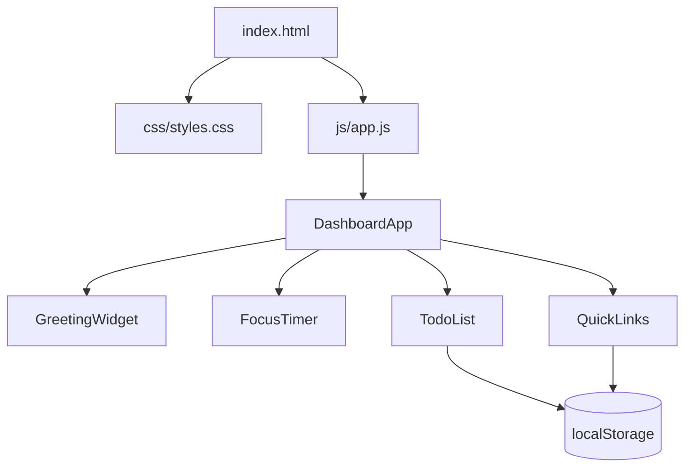

# Design Document — To-Do List Life Dashboard

## Overview

The To-Do List Life Dashboard is a self-contained, client-side single-page application (SPA) built with plain HTML, CSS, and Vanilla JavaScript. It runs entirely in the browser with no build step, no server, and no external dependencies. All user data is persisted via the browser's `localStorage` API.

The application is composed of four independent widgets that are initialised and coordinated by a single top-level `DashboardApp` module:

| Widget | Responsibility |
|---|---|
| `GreetingWidget` | Displays current time, date, and a time-based greeting |
| `FocusTimer` | 25-minute Pomodoro-style countdown timer |
| `TodoList` | Persistent task management (add, edit, complete, delete) |
| `QuickLinks` | Persistent URL shortcut panel (add, open, delete) |

The entire application is delivered as three files:

```
index.html          — markup and widget scaffolding
css/styles.css      — all visual styles
js/app.js           — all application logic
```

---

## Architecture

### High-Level Structure



### Module Pattern

Because the project uses a single JavaScript file with no bundler, all code is wrapped in an IIFE (Immediately Invoked Function Expression) or uses ES module-style closures to avoid polluting the global scope. Each widget is implemented as a factory function that returns a public API object.

```
js/app.js
├── StorageService        — thin wrapper around localStorage (get/set/remove)
├── GreetingWidget        — time/date/greeting display and interval management
├── FocusTimer            — countdown logic and button state management
├── TodoList              — task CRUD, validation, and DOM rendering
├── QuickLinks            — link CRUD, validation, and DOM rendering
└── DashboardApp          — initialises all widgets on DOMContentLoaded
```

### Data Flow

All state is held in memory inside each widget's closure. Mutations that affect persistence (task add/edit/complete/delete, link add/delete) immediately call `StorageService.set()` to write the updated collection to `localStorage`. On page load, each widget reads its own key from `localStorage` via `StorageService.get()` and renders the restored state.

---

## Components and Interfaces

### StorageService

A thin, stateless utility that wraps `localStorage` with JSON serialisation.

```js
StorageService = {
  get(key)         → any | null   // JSON.parse; returns null on missing/corrupt data
  set(key, value)  → void         // JSON.stringify
  remove(key)      → void
}
```

**Storage keys:**

| Key | Widget | Value type |
|---|---|---|
| `tld_tasks` | TodoList | `Task[]` |
| `tld_links` | QuickLinks | `Link[]` |

### GreetingWidget

Reads the system clock on initialisation and every 60 seconds via `setInterval`.

```js
GreetingWidget.init(containerEl) → void
```

Internal helpers:
- `formatTime(date)` → `"HH:MM"` string
- `formatDate(date)` → `"Weekday, D Month YYYY"` string
- `getGreeting(hour)` → `"Good Morning" | "Good Afternoon" | "Good Evening" | "Good Night"`

### FocusTimer

Manages a single `setInterval` reference. Exposes three controls mapped to DOM buttons.

```js
FocusTimer.init(containerEl) → void
// Internal state: remainingSeconds, intervalId, isRunning
// Public actions (bound to buttons): start(), stop(), reset()
```

Button enable/disable rules:
- Start: enabled when `!isRunning`
- Stop: enabled when `isRunning`
- Reset: always enabled

### TodoList

Manages an in-memory `Task[]` array. All mutations sync to `localStorage`.

```js
TodoList.init(containerEl) → void
// Internal state: tasks: Task[]
// Actions: addTask(text), editTask(id, newText), toggleTask(id), deleteTask(id)
// Rendering: renderAll(), renderTask(task)
```

Validation rules:
- `addTask`: rejects if `text.trim() === ""`
- `editTask`: rejects if `newText.trim() === ""`; retains original text on rejection

### QuickLinks

Manages an in-memory `Link[]` array. All mutations sync to `localStorage`.

```js
QuickLinks.init(containerEl) → void
// Internal state: links: Link[]
// Actions: addLink(label, url), deleteLink(id)
// Rendering: renderAll(), renderLink(link)
```

Validation rules:
- `addLink`: rejects if `label.trim() === ""` or `url.trim() === ""`
- `addLink`: rejects if URL does not start with `"http://"` or `"https://"`

### DashboardApp

```js
DashboardApp.init() → void
// Called on DOMContentLoaded
// Calls .init(containerEl) on each widget with the corresponding DOM element
```

---

## Data Models

### Task

```js
{
  id:        string,   // crypto.randomUUID() or Date.now().toString()
  text:      string,   // non-empty task description
  completed: boolean   // false = incomplete, true = done
}
```

### Link

```js
{
  id:    string,  // crypto.randomUUID() or Date.now().toString()
  label: string,  // non-empty display label
  url:   string   // must start with "http://" or "https://"
}
```

### localStorage Schema

```js
// Key: "tld_tasks"
Task[]   // array of Task objects; defaults to [] when absent or unparseable

// Key: "tld_links"
Link[]   // array of Link objects; defaults to [] when absent or unparseable
```

Both keys are written atomically (full array replacement) on every mutation. Corrupt or missing data is treated as an empty array — no error is surfaced to the user.

---

## Correctness Properties

*A property is a characteristic or behavior that should hold true across all valid executions of a system — essentially, a formal statement about what the system should do. Properties serve as the bridge between human-readable specifications and machine-verifiable correctness guarantees.*

### Property 1: Greeting is determined solely by hour

*For any* `Date` object, `getGreeting(date.getHours())` SHALL return exactly one of `"Good Morning"`, `"Good Afternoon"`, `"Good Evening"`, or `"Good Night"`, and the result SHALL be consistent with the hour ranges defined in Requirements 1.3–1.6.

**Validates: Requirements 1.3, 1.4, 1.5, 1.6**

---

### Property 2: Time format is always HH:MM

*For any* `Date` object, `formatTime(date)` SHALL return a string that matches the regular expression `/^\d{2}:\d{2}$/`.

**Validates: Requirements 1.1**

---

### Property 3: Task addition round-trip

*For any* non-empty task description string, after calling `addTask(text)` the resulting `Task[]` stored in `localStorage` under `"tld_tasks"` SHALL contain an entry whose `text` property equals the trimmed input.

**Validates: Requirements 3.2, 3.10**

---

### Property 4: Empty and whitespace-only task descriptions are rejected

*For any* string composed entirely of whitespace characters (including the empty string), calling `addTask(text)` SHALL leave the task list unchanged and SHALL NOT write a new entry to `localStorage`.

**Validates: Requirements 3.3**

---

### Property 5: Task edit round-trip

*For any* existing task and any non-empty replacement description, after calling `editTask(id, newText)` the task's `text` in the in-memory array and in `localStorage` SHALL equal `newText.trim()`.

**Validates: Requirements 3.5, 3.10**

---

### Property 6: Empty edit is rejected — task text is preserved

*For any* existing task and any string composed entirely of whitespace, calling `editTask(id, whitespaceText)` SHALL leave the task's `text` unchanged in both the in-memory array and `localStorage`.

**Validates: Requirements 3.6**

---

### Property 7: Completion toggle is an involution

*For any* task, toggling completion twice SHALL return the task to its original `completed` state. That is, `toggle(toggle(task)).completed === task.completed`.

**Validates: Requirements 3.7, 3.8**

---

### Property 8: Task deletion removes exactly one entry

*For any* task list and any task `id` present in that list, after calling `deleteTask(id)` the resulting list SHALL have exactly one fewer element and SHALL NOT contain any task with that `id`.

**Validates: Requirements 3.9**

---

### Property 9: localStorage persistence round-trip for tasks

*For any* `Task[]`, serialising it to `localStorage` via `StorageService.set("tld_tasks", tasks)` and then deserialising via `StorageService.get("tld_tasks")` SHALL produce an array that is deeply equal to the original.

**Validates: Requirements 3.10, 3.11**

---

### Property 10: Link addition round-trip

*For any* non-empty label and valid URL (starting with `"http://"` or `"https://"`), after calling `addLink(label, url)` the resulting `Link[]` in `localStorage` SHALL contain an entry with matching `label` and `url`.

**Validates: Requirements 4.2, 4.7**

---

### Property 11: Invalid link submissions are rejected

*For any* combination of empty label, empty URL, or URL that does not start with `"http://"` or `"https://"`, calling `addLink(label, url)` SHALL leave the link list unchanged.

**Validates: Requirements 4.3, 4.4**

---

### Property 12: Link deletion removes exactly one entry

*For any* link list and any link `id` present in that list, after calling `deleteLink(id)` the resulting list SHALL have exactly one fewer element and SHALL NOT contain any link with that `id`.

**Validates: Requirements 4.6**

---

### Property 13: localStorage persistence round-trip for links

*For any* `Link[]`, serialising it to `localStorage` via `StorageService.set("tld_links", links)` and then deserialising via `StorageService.get("tld_links")` SHALL produce an array that is deeply equal to the original.

**Validates: Requirements 4.7, 4.8**

---

### Property 14: Focus timer countdown is monotonically decreasing

*For any* starting value of `remainingSeconds` in `[1, 1500]`, each tick of the timer SHALL decrease `remainingSeconds` by exactly 1, and the timer SHALL stop automatically when `remainingSeconds` reaches 0.

**Validates: Requirements 2.2, 2.3, 2.6**

---

### Property 15: Focus timer reset restores initial state

*For any* timer state (running or paused, any `remainingSeconds`), calling `reset()` SHALL set `remainingSeconds` to 1500 (25 × 60) and SHALL stop any active interval.

**Validates: Requirements 2.5**

---

## Error Handling

### localStorage Unavailability

`localStorage` may be unavailable (private browsing mode, storage quota exceeded, or browser restrictions). `StorageService.get` and `StorageService.set` are wrapped in `try/catch`. On failure:
- `get` returns `null` (treated as empty array by callers)
- `set` silently fails — the in-memory state remains correct for the current session

No error is surfaced to the user; the app degrades gracefully to an in-memory-only session.

### Corrupt localStorage Data

If `JSON.parse` throws during `StorageService.get`, the error is caught and `null` is returned. Callers default to an empty array, so the widget renders cleanly with no tasks or links.

### Invalid Task / Link Input

Validation errors (empty text, invalid URL) are surfaced as inline messages adjacent to the relevant input field. The message is cleared on the next valid submission or when the input field is modified.

### Timer Edge Cases

- Calling `start()` while the timer is already running is a no-op (Start button is disabled).
- Calling `stop()` while the timer is not running is a no-op (Stop button is disabled).
- `reset()` always clears the interval reference before setting new state to prevent double-interval bugs.

---

## Testing Strategy

### Approach

Because this project uses no framework and no build tool, tests are written as plain JavaScript functions that can be run in a browser console or a minimal Node.js test harness (e.g., a single `test.js` file using `console.assert`). No test framework installation is required.

### Unit Tests (Example-Based)

Unit tests cover specific, concrete scenarios:

- `GreetingWidget`: verify each of the four greeting messages for representative hours (e.g., hour 6 → "Good Morning", hour 14 → "Good Afternoon", hour 19 → "Good Evening", hour 23 → "Good Night").
- `FocusTimer`: verify initial state is 25:00; verify Start disables itself; verify Stop re-enables Start; verify Reset from mid-countdown restores 25:00.
- `TodoList`: verify adding a task with a valid description appears in the list; verify adding an empty string is rejected; verify editing with empty string is rejected; verify delete removes the correct task.
- `QuickLinks`: verify adding a link with a valid label and URL appears; verify empty label is rejected; verify empty URL is rejected; verify URL without `http(s)://` is rejected; verify delete removes the correct link.
- `StorageService`: verify `get` returns `null` for a missing key; verify `set` then `get` round-trip; verify corrupt JSON returns `null`.

### Property-Based Tests

Property-based testing is appropriate for this feature because the core logic consists of pure functions (greeting classification, time formatting, input validation, CRUD operations) whose correctness must hold across a wide input space.

**Library**: [fast-check](https://github.com/dubzzz/fast-check) (JavaScript property-based testing library).

**Configuration**: Each property test runs a minimum of **100 iterations**.

**Tag format**: `// Feature: todo-life-dashboard, Property N: <property_text>`

Properties to implement (one test per property):

| Property | Test description |
|---|---|
| P1 — Greeting by hour | Generate arbitrary integers 0–23; assert result is one of the four valid strings and matches the correct range |
| P2 — Time format HH:MM | Generate arbitrary `Date` objects; assert `formatTime` output matches `/^\d{2}:\d{2}$/` |
| P3 — Task add round-trip | Generate arbitrary non-empty strings; add task; assert `localStorage` contains matching entry |
| P4 — Whitespace task rejected | Generate arbitrary whitespace-only strings; assert list is unchanged |
| P5 — Task edit round-trip | Generate arbitrary task + non-empty replacement; assert text updated in memory and storage |
| P6 — Empty edit rejected | Generate arbitrary task + whitespace string; assert text unchanged |
| P7 — Toggle involution | Generate arbitrary task; toggle twice; assert `completed` unchanged |
| P8 — Delete removes one | Generate arbitrary task list + valid id; delete; assert length − 1 and id absent |
| P9 — Task storage round-trip | Generate arbitrary `Task[]`; serialise then deserialise; assert deep equality |
| P10 — Link add round-trip | Generate arbitrary label + valid URL; add; assert storage contains entry |
| P11 — Invalid link rejected | Generate invalid inputs (empty label/URL, bad URL prefix); assert list unchanged |
| P12 — Link delete removes one | Generate arbitrary link list + valid id; delete; assert length − 1 and id absent |
| P13 — Link storage round-trip | Generate arbitrary `Link[]`; serialise then deserialise; assert deep equality |
| P14 — Timer countdown monotonic | Generate starting seconds in [1, 1500]; tick N times; assert `remainingSeconds` decreases by N and stops at 0 |
| P15 — Timer reset restores state | Generate arbitrary timer state; call reset; assert `remainingSeconds === 1500` and no active interval |

### Integration / Smoke Tests

- Verify the page loads without JavaScript errors in Chrome, Firefox, Edge, and Safari.
- Verify that tasks and links added in one session are present after a page reload (end-to-end `localStorage` round-trip).
- Verify the timer display updates every second while running (manual observation or a short automated wait).
