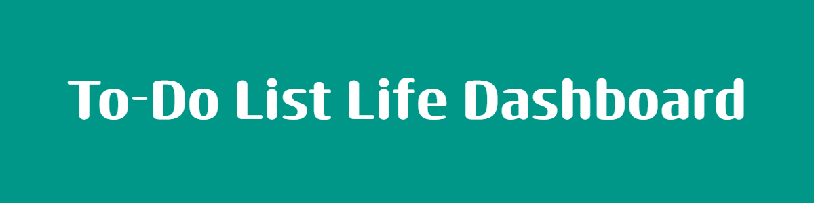

## About This Project

 

A comprehensive, browser-based dashboard designed to streamline your daily workflow. This project was developed as a requirement for the RevoU CodingCamp Certification, focusing on state management, local storage persistence, and clean UI/UX principles.

## Key Feature

<strong>Personal Greeting HUD</strong>

- Dynamic Clock: Real-time display of the current date and time.
- Contextual Greetings: Automatically adjusts based on the time of day (Morning, Afternoon, Evening).
- Customization: Set and save your name to personalize the interface.

<strong>Advanced Pomodoro Timer</strong>

- Focus Mode: Default 25-minute countdown to maximize productivity.
- Full Control: Start, stop, and reset functionality.
- Custom Intervals: Adjust the Pomodoro duration to fit your personal workflow.

<strong>Task Management (To-Do List)</strong>

- CRUD Operations: Seamlessly add, edit, mark as complete, or delete tasks.
- Persistence: All tasks are saved to Local Storage, so your data remains even after a page refresh.
- Duplicate Prevention: Prevents adding the same task twice.
- Auto-Sort: Keeps your list organized automatically.

<strong>Quick Links</strong>

- Favorites Bar: Instant access to your most-visited websites.
- Saved Preferences: Links are stored locally for a personalized browsing experience.
